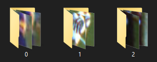
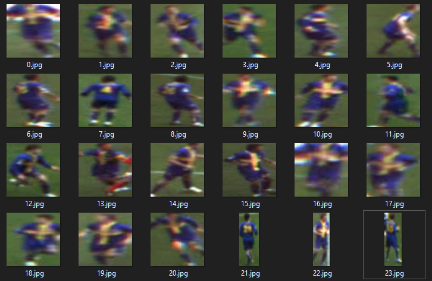
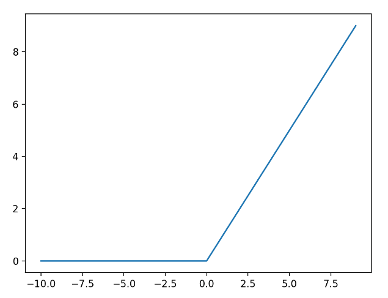
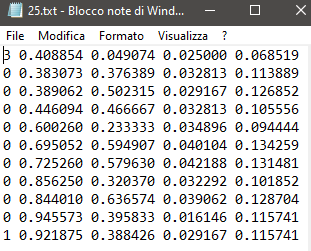
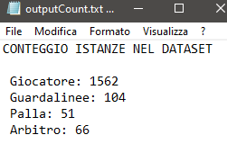
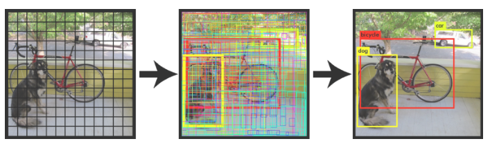
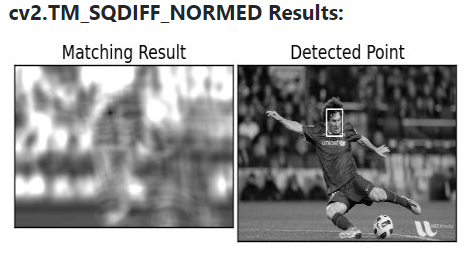

<p align="center" style="margin-top: -5%" >Footpad è un applicazione che usa algoritmi di Machine Learning su video di partite calcistiche con particolare attenzione su algoritmi di 
   - Multiple Object Detection tramite YOLO 
   - Image Classification tramite Keras
   - Perspective Transformation tramite Opencv </p>

<p align="center">
  <a href="https://github.com/LRalli/FOOTPAD/blob/main/LICENSE">
    
  </a>
  <a href="https://www.codefactor.io/repository/github/lralli/footpad"></a>
</p>

<br><br>

Se si vuole testare l'applicazione con il Dataset già allenato basta effettuare la clone della repo con
```
 git clone https://github.com/LRalli/FOOTPAD.git
```
e avviare lo script principale con
```
python Main_Script.py
```
Python e alcune sue librerie, tra cui Tensorflow e Opencv, devono essere installate sulla propria macchina

<br>

Altrimenti, se si vuole allenare un proprio Dataset, si seguano le istruzioni presenti all'interno del notebook ```Footpad.ipynb``` tramite utilizzo di Google Colab

<br>

<h2 align="center">KERAS MODEL TRAINING</h2>

1. __Preparazione Dataset__
<p>Una volta scelto il numero di classi che si vogliono identificare bisogna creare, nella cartella Dataset che verrà usata per il training, x cartelle (con x = numero di classi scelte) e nominarle rispettivamento 0,1,...,x</p>

<p align="center">
  
</p>

<p>Dopodiche bisogna riempire queste cartelle con gli oggetti che si vuole classificare (in questo caso giocatori e assistenti di gara), per farlo si prende ogni giocatore (o assistente di gara) che compare nella clip scelta e si salva l'immagine (di cui non importa la dimensione poichè ogni immagine verrà ri-dimensionata durante il pre-processamento) nell'apposita cartella in base la classe di appartenenza</p>

<p align="center">
  
</p>

Terminata la preparazione del Dataset questo verrà pre-processato per inserire le immagini all'interno di un batch (array numpy) che verrà passato all'Input_Layer del network

<br>

2. __Keras Classification__

Utilizzando Keras con backend Tensorflow possiamo realizzare una Convolutional Neural Network in grado di classificare il tipo di "persona" in campo (giocatore o assistente di gara) e la squadra di appartenenza del giocatore

<br>

I primi 7 Hidden_Layers del CNN sono un insieme di Convolutional Layers e Max Pooling layers, tutti con funzione di attivazione ```relu```

Relu (Rectified Linear Unit) è una funzione di attivazione lineare che ritorna 0 se riceve un input negativo mentre se riceve un valore positivo ritorna proprio quel valore, quindi può essere scritta come y = max(0,x)

<p align="center">
  
</p>

gli ultimi Hidden_Layers invece sono il Flattening Layer per mettere tutte le informazioni sulla stessa riga, i Dense Layers per compattarle e un Dropout Layer per rimuovere il rumore

l'ultimo Dense Hidden_Layer usa ```sigmoid``` come funzione di attivazione per garantire che l'output sia un numero compreso tra 0 e 1

l'Output_Layer generato viene infine compilato come modello Keras e viene salvato come ```model2.h5```

<br>

<h2 align="center">YOLO WEIGHTS TRAINING</h2>

1. __Preparazione Dataset__
<p>Per prima cosa bisogna scegliere un video di una partita su cui si vuole effettuare la Detection</p>

Successivamente tramite l'utlizzo del software ```LabelImg``` è necessario effettuare il labeling manuale delle classi su cui si vuole che l'algoritmo YOLO venga allenato per la Detection.

Le classi scelte sono state:
   - Giocatore
   - Arbitro
   - Guardalinee
   - Palla

LabelImg prende in input un insieme di immagini (I frame del video) e per ogni immagine, una volta finito il lavoro di labeling manuale, genera un file .txt con le coordinate degli oggetti su cui è stato tracciato il label, per ottenere frame del video ogni x secondi è possibile usare lo script ```frame_shot.py```

Dopo aver lanciato lo script è possibile avviare LabelImg con
```
python labelImg.py [path della cartella contenente le immagini] [file .txt con i nomi delle classi]
```

Frame video su LabelImg:


Corrispondente file .txt generato:

<p align="center">
  
</p>

in cui le colonne rappresentano rispettivamente
 - Object ID : ID corrispondente alla classe di appartenenza dell'oggetto
 - center_x : coordinata x del centro del rettangolo
 - center_y : coordinata y del centro del rettangolo
 - width : larghezza del rettangolo
 - height : altezza del rettangolo

Una volta terminato il processo di Labeling è possibile utilizzare lo script ```count_instances.py``` per ottenere in output un file .txt contenente il numero di istanze trovate per classe:

<p align="center">
  
</p>

<br>

2. __Object Detection__
<p>Ora è possibile generare le Yolo weights tramite l'utilizzo dell' open source neural network framework Darknet tramite Google Colab (è stato preparato un procedimento guidato nel notebook)</p>

Darknet è un open source neural network framework scritto in C e CUDA che utilizza per la Object Detection l'algoritmo YOLO (You Only Look Once), un algoritmo che permette di identificare più oggetti e, allo stesso tempo, di identificare la loro posizione e lo spazio che occupano tramite solamente una single reading delle immagini in input

<p align="center">
  
</p>

Il concetto su cui si basa YOLO è quello di ridimensionare l'immagine cosi da ottenere una grid di quadrati che verrà poi analizzata attraverso un CNN

<br><br>

<h2 align="center">DETECTION</h2>

__Calcolo Matrice per Perspective Transformation__

Per prima cosa bisogna usare lo script ```Get_Matrix.py``` per calcolare la matrice di Perspective Transformation,
questo script prende in input:
- Frame del video in cui è visibile la porzione di campo che si vuole mappare sull'immagine plane
- L'immagine plane

<p>Dopodiche bisognerà scegliere 4 fixed points del campo sul frame e mapparli sull'immagine plane (è possibile effettuare prove per trovare i punti decommentando i rispettivi Test)</p>

Per il frame del video sono stati scelti questi 4 punti (scelta approssimata di uno dei punti che non è visibile del frame ed è stata tenuta in conto l'angolazione dell'inquadratura): 


E sono stati presi i corrispettivi sull'immagine Plane:


Una volta inseriti in un array np.float32 è possibile passare i punti come argomenti della funzione ```getPerspectiveTransform``` per ottenere la matrice di trasformazione della prospettiva

<p>E' anche possibile testare il corretto funzionamento della matrice decommentando l'apposito Test all'
interno dello script e cambiando il punto che viene scelto per il test (che di default è il centro
del campo sul frame video)</p>
<br>

__Multiple Object Detection & Perspective Transformation__

Tramite lo script ```MainScript.py``` è possibile ottenere in output il video con applicati la Object Detection, la Object Classification e la Perspective Transformation

<p>Il codice è stato appositamente diviso tramite commenti in più sezioni per facilitarne l'uso, queste sezioni sono: </p>

1. __Fase di Set-Up__

   - Fase in cui caricare
     - Il modello Keras allenato in precedenza
     - Il video su cui effettuare la Detection
     - L'immagine plane su cui effettuare la Perspective Transformation
     - L'immagine della palla, su cui verrà effettuata la Detection usando un altra tecnica a causa dei scarsi risultati ottenuti dalla weight YOLO

2. __Load Yolo__

   - Fase in cui si prepara l'algoritmo YOLO inizializzando il dnn con le weights allenate in precedenza + il file di configurazione yolo e in cui si estraggono le classi dal data file per preparare gli output layers degli oggetti trovati con la Detection

3. __Funzione get_detected()__

   - Funzione che ha il compito di gestire gli output_layers ottenuti dalla Detection, dopo aver estratto le info tra cui scores, class_ids e boxes procede al calcolo delle coordinate della posizione dell'oggetto e salva tutte le info raccolte in array

   - Infine cicla sugli oggetti trovati e, dopo aver applicato NoMaxSuppression per rimuovere il rumore, controlla se il label dell'oggetto trovato è diverso da "Palla", in caso positivo salva le info dell'oggetto nell'array che poi viene restituito come output e che verrà usato per disegnare i rettangoli 

4. __Funzione plane()__

   - Funzione che usa la matrice di Perspective Transformation e gli oggetti trovati dalla Detection per disegnare sull'immagine plane i pallini relativi ai giocatori/assistenti di gara su schermo, dopo aver estratto la posizione del giocatore e dopo averla usata per mappare la posizione sulla mappa controlla il valore della classificazione, valore che viene aggiunto all'array con le informazioni del giocatore prima di chiamare la funzione, e in base al valore determina di che colore creare il punto sull'immagine plane

   - Effettua la stessa operazione per la palla le cui informazioni vengono salvate in un apposito array prima di chiamare la funzione

5. __Fase Main__

  - Fase principale del programma in cui:
     - Si cicla sul ogni frame della clip data in input per effettuare la detection
     - Si estraggono le features tramite Blob e si passano al dnn per generare gli output players
     - Si passano le informazioni estratte dagli output layers alla funzione get_detected
     - Si usa il model Keras per fare la predizione e si salva il valore ottenuto nell'array contenente l'info delle detection che è stato ritornato da get_detected
     - Si usa il valore rilasciato da Keras per disegnare su schermo i rettangoli e colorarli appositamente in base la classe identificata
     - Si passa questo array alla funzione plane()
     - Si effettua la Detection della palla
     - Si salvano il frame ottenuto e l'immagine plane su video

<br>

  - Per la Detection della palla, visti i risultati scarsi ottenuti affidandoci solamente alle weights YOLO, si usa il Template Matching con metodo ```TM_SQDIFF_NORMED```, vengono passate alla funzione matchTemplate() l'immagine della palla caricata nella fase di Set-Up e la sua versione grayscale che generiamo in questa fase, per il metodo scelto la palla sarà il punto più scuro che esce fuori dal matching

<p align="center">
  
</p>


<h2 align="center">RISULTATI E CONSIDERAZIONI</h2>

[WORK IN PROGRESS]
